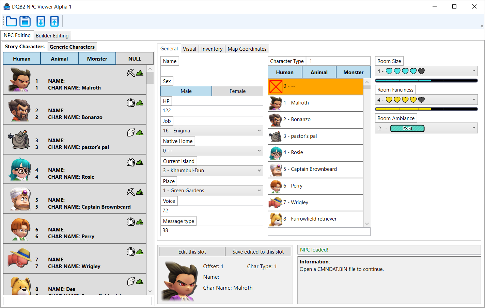
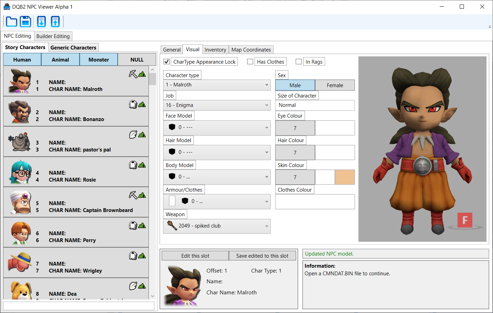
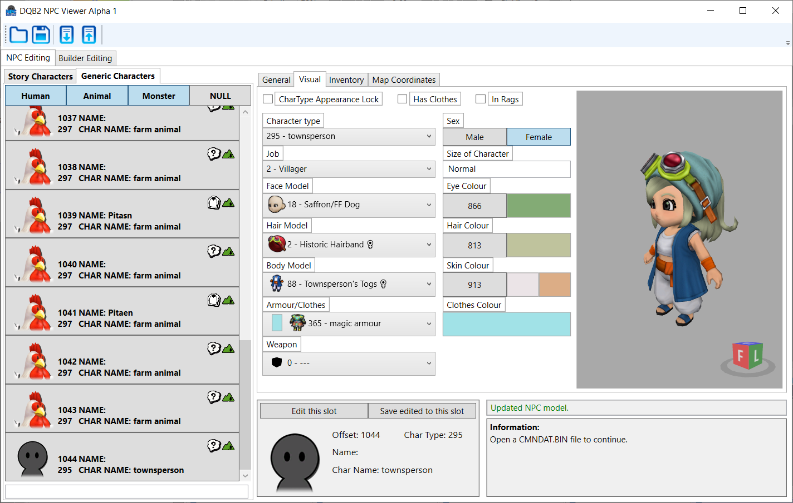
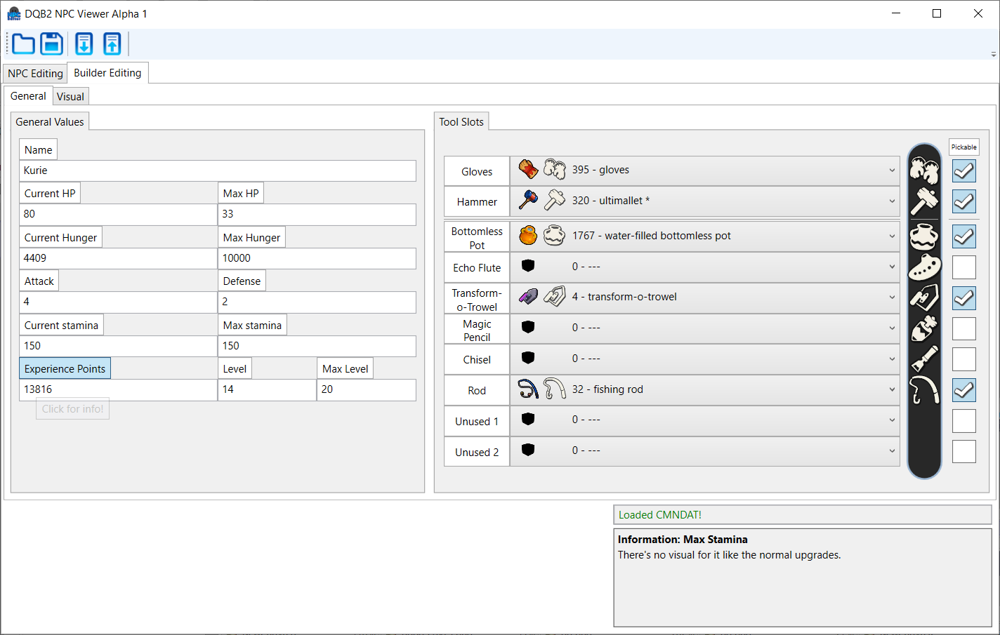
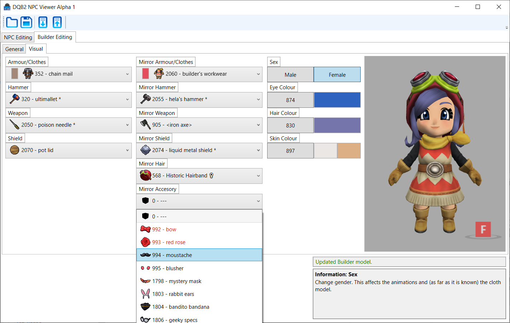
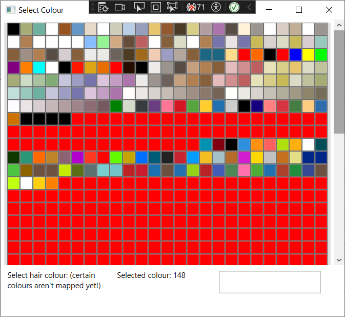
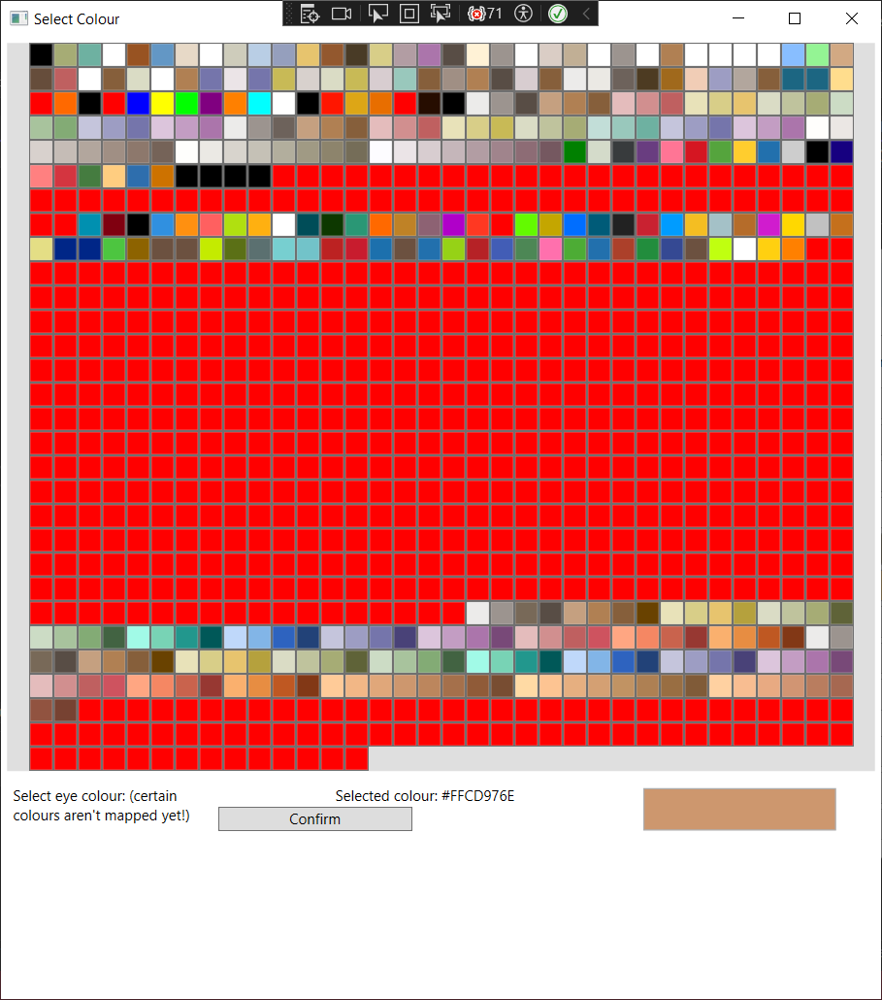
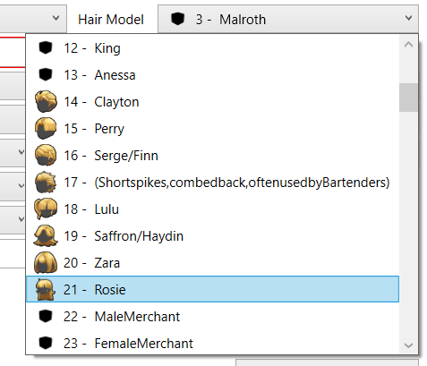

# DQB2NPCViewer
NPC editor with a visual component for feedback. Info taken from [the save editor](https://github.com/turtle-insect/DQB2) by turtle-insect.

## Progress report:

### 2025 - Refactor of all code.
Important things that are missing currently:
- Map coordinates
- Animals
- Type lock list
- Place stuff
- Info on all fields
- Info on jobs and such
- Coding that info, coding the console.

Things for the possible future
- Inventory
- Models for weapons

### 2024 - Alpha build now available!
Documentation coming soon. As of now every option has info attached to it, so use that if you really need to.

### Screenshots:
- Menu  
  
- Model updating  
 
 
- Builder menu  
 
- Builder visual  
 
- Colour selection  
 
- Resizeable  
 
- Menus will have dropdown for everything  
 
