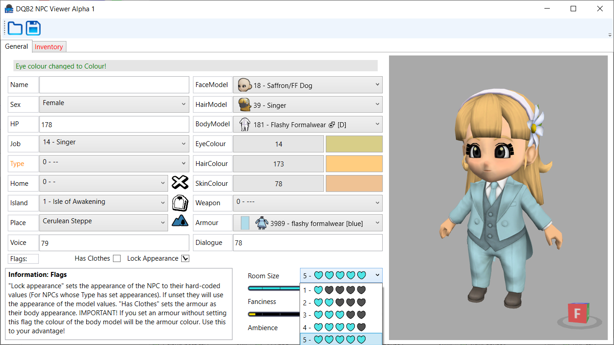
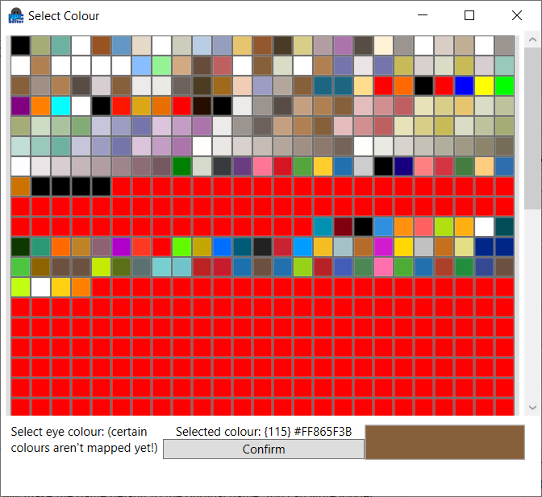

# DQB2NPCViewer
NPC editor with a visual component for feedback. Info taken from [the save editor](https://github.com/turtle-insect/DQB2) by turtle-insect.

## Progress report:

### Pre-Alpha build is avaliable. 
  

Has basic Save and Load functionality. Every value should be edited and loaded proterly. Model picking has some glitches related to picking non-valid models & lock appearance.

**BIGGEST PROBLEM** -> Textures & Models are not optimized. I couldn't even upload the body models from how big they are. I will have to do some optimizing on those. 
**COLORS ARE NOT ACCURATE** -> Masks are missing. Blending is not fine-tuned.

Note: I only have formal knowdledge on some Python and base C. Everything else is self-taught. If some code hurts the eyes I would be grateful for any suggestions.

### Implementation priority list:
**Easy**
- Add all images to basic values
  
**Things to do**
- Create ALL images for the models
- Optimize textures (turn PNG) and models (change format)
- Masks for colours
- Categorize ALL type and their model locks.
  
**Low priority**
- Weapon & Armourn(Problem is the colour filters with those-should I add weapon models to the viewer?)
- Colour balance (Recreate glitch I found in-game)
- Inventory
- Info box

## Current screenshots:
- Menu  
  
- Model updating  
 
- Colour selection  
 
- Resizeable  
 
- Menus will have dropdown for everything  
 
