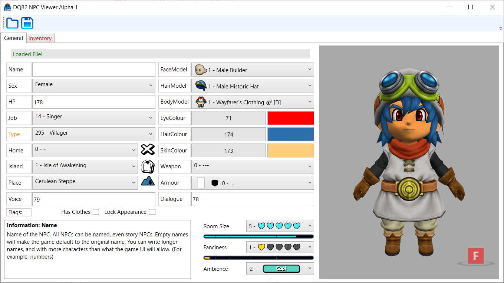

# DQB2NPCViewer
NPC editor with a visual component for feedback. Info taken from [the save editor](https://github.com/turtle-insect/DQB2) by turtle-insect.

## Progress report:
### Reads, edits:
- Name
- Sex
- HP
- Job
- Home
- Island
- Place
- Face, body, hair (model & colour)
### Missing:
- Type
- Lock appearance
- Voice
- Dialogue
- Weapon
- Armour
- Room preferences

### Other:
- Saving is not implemented yet
- Images missing
- Colours and texture masks still in process
- Inventory won't be in the first release
- Voice preview wont be in first release

## Current screenshots:
- Menu  
  
- Model updating  
 
- Colour selection  
 
- Resizeable  
 
- Menus will have dropdown for everything  
 
