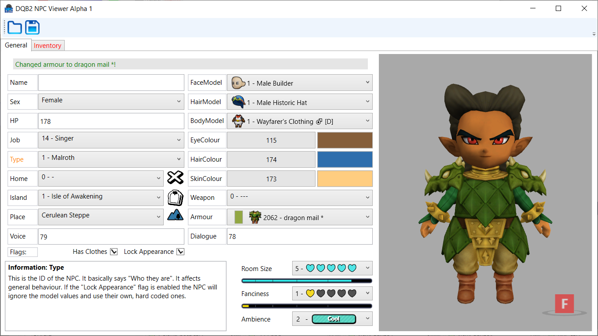

# DQB2NPCViewer
NPC editor with a visual component for feedback. Info taken from [the save editor](https://github.com/turtle-insect/DQB2) by turtle-insect.

## Progress report:
### Alpha build now available!

Documentation coming soon. As of now every option has info attached to it, so use that if you really need to.

**MISSING:**
- Inventory
- Body Images
- Type locks
- Weapons
- Monsters

## Current screenshots:
- Menu  
  
- Model updating  
 
- Colour selection  
 
- Resizeable  
 
- Menus will have dropdown for everything  
 
